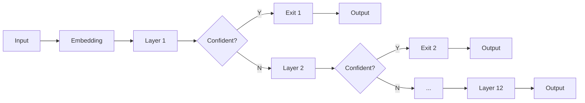

# Efficient PLMs

## from the perspective of Early Exiting

<div class="abs-br m-6 flex gap-2">
  <button @click="$slidev.nav.openInEditor()" title="Open in Editor" class="text-xl icon-btn opacity-50 !border-none !hover:text-white">
    <carbon:edit />
  </button>
  <a href="https://github.com/sbwww" target="_blank" alt="GitHub"
    class="text-xl icon-btn opacity-50 !border-none !hover:text-white">
    <carbon-logo-github />
  </a>
</div>

<style>
h2 {
  
  background-color: #fff;
}
</style>

---

## Preliminaries

<v-clicks>


</v-clicks>

<style>
img {
  height: 400px;
  position: absolute;
  top: 100px;
  left: 50px;
}
</style>

<!-- https://nlp.stanford.edu/manning/talks/MILA-BERT-2019.pdf -->

---

## What & Why?

To exit after being _confident_ to the results during inference.

Don't need to execute **ALL** the model layers.

<br>

<v-click>

w/ EE

Layer 1 → Layer 2 → Layer 3 <span class='skip'>→ Layer 4 → ... → Layer 12</span>

&emsp; X &emsp; → &emsp; X &emsp; → &emsp; √ &emsp; → **Output**

<center>Depending on inputs</center>

</v-click>

<style>
span.skip {
  opacity: 0.3;
}
center {
  font-size: 40px;
  padding-top: 40px;
}
</style>

---

## Illustrated Premise


- _Easy_ inputs

confident, aggressive

- _Hard_ inputs

perplexed, conservative

<br><br>

<v-click>

- Measuring difficulty?

open question

</v-click>

<style>
img {
  width: 60%;
  margin-right:40px;
}
</style>

---

## Illustrated Architecture

<br><br><br>



<br><br>

<v-click>

<center>Branchy</center>

</v-click>

<style>
center {
  font-size: 40px;
}
</style>

---

## Pros & Cons

- <font size=6>Pros</font>
  1. **Elastic** - single model with dynamic configs at inference time
  2. **Efficiency** - reduced inference time & energy consumption
  3. **Effectiveness** - reduced overthinking (_overfitting_ of inference) [^shallow-deep]

<br>

<v-click>

- <font size=6>Cons (Insights for new papers)</font>
  1. **Trade-off** - accuracy V.S. time-saving
  2. **Compatibility** - not yet compatible to every task
  3. **Implementation** - no uniformed approach to evaluate _confidence_

</v-click>

[^shallow-deep]: [Shallow-Deep Networks: Understanding and Mitigating Network Overthinking [ICML2019]<br>University of Maryland](https://arxiv.org/abs/1810.07052)

<style>
.footnotes p {
  font-size: 20px !important;
}
.footnotes-sep {
  @apply mt-0 opacity-10;
}
</style>

---

## How?

1. Entropy [^deebert]
2. Patience [^pabee]
3. Learning-based
4. Pretraining [^elue]

[^deebert]: [DeeBERT: Dynamic Early Exiting for Accelerating BERT Inference [ACL 2020]<br>University of Waterloo, Vector Institute of AI](https://arxiv.org/abs/2004.12993)
[^pabee]: [BERT Loses Patience: Fast and Robust Inference with Early Exit [NIPS 2020]<br>Beihang University, University of California, MSRA](https://arxiv.org/abs/2006.04152v3)
[^elue]: [Towards Efficient NLP: A Standard Evaluation and A Strong Baseline [WIP]<br>Fudan University, Huawei Poisson Lab](https://arxiv.org/abs/2110.07038v1)

<style>
.footnotes-sep {
  @apply mt-0 opacity-10;
}
</style>

---

## Method 1 --- Entropy

<br>

$$
H(x) = -\sum_{i} p(i) \ln p(i) = \ln \left(\sum_{i=1}^{n} e^{x_{i}}\right)-\frac{\sum_{i=1}^{n} x_{i} e^{x_{i}}}{\sum_{i=1}^{n} e^{x_{i}}}
$$

<br>

- $H(x)<E_T$ ? [^deebert]

  entropy lower than threshold → confident → exit

  otherwise, higher than threshold → perplexed → run more layers

[^deebert]: [DeeBERT: Dynamic Early Exiting for Accelerating BERT Inference [ACL 2020]<br>University of Waterloo, Vector Institute of AI](https://arxiv.org/abs/2004.12993)

---

## Illustrated Entropy --- Binary Class

$$H(x) = F(p_0) = -\big(p_0 \ln p_0 + (1-p_0) \ln (1-p_0)\big)$$

where $p_0, p_1 = \operatorname{softmax}(x)$, and $p_1 = 1-p_0$

| <center></center> | <center></center> |
| :--------------------------------------------------------------: | :-------------------------------------------------------: |

- $\argmax\limits_{p_0} F(p_0) = 0.5$, &ensp;&nbsp; $\max\limits F(p_0) = \ln 2 = 0.69$
- &emsp;&nbsp; $\lim\limits_{p_0\rightarrow 0^+} F(p_0) = 0$ &ensp; , &nbsp;&thinsp; $\lim\limits_{p_0\rightarrow 1^-} F(p_0) = 0$

<style>
img {
  width: 350px;
  transition: all 0.2s;
}
img:hover {
  background: #fff;
  transform: scale(1.5);
}
</style>

---

## Implements

```py {all|2|3-6|all}
def entropy(x):
    # x: torch.Tensor, logits BEFORE softmax
    exp_x = torch.exp(x)
    A = torch.sum(exp_x, dim=1)    # sum of exp(x_i)
    B = torch.sum(x*exp_x, dim=1)  # sum of x_i * exp(x_i)
    return torch.log(A) - B/A
```

<v-click>

```py {all|1-3|4-8|all}
# GLUE BertForSequenceClassification pooled_outputs
# x.size() = (batch_size=1, num_labels=2)
[[0.0, 0.1]]
# NER  BertForTokenClassification sequence_outputs
# x.size() = (batch_size=1, seq_len=128, num_labels=9)
[[[0.0, 0.1, ..., 0.8],
  [1.0, 1.2, ..., 1.8],
             ...      ]]
```

</v-click>

---

## Fix

<br>

```py {all|3-6}
def entropy(x):
    # x: torch.Tensor, logits BEFORE softmax
    # softmax normalized prob distribution
    x = torch.softmax(x, dim=-1)
    # entropy calculation on probs: -\sum(p \ln(p))
    return -torch.sum(x*torch.log(x), dim=-1)
```

<br><br>

<v-click>

- Sometimes `dim=1`, always `dim=-1`
- `torch.softmax()` more efficient than manual calculation

</v-click>

---

## Training DeeBERT

Two-stage

1. Ordinary fine-tuning
   - Embedding, all Transformers, and the last classifier
2. Each classifier (ex. the last) training
   - Freeze the above parameters that are already fine-tuned
   - $\mathcal{L}=\sum_{i=1}^{n-1} \cdot \mathcal{L}_{i}$

<v-click>

<br><br>

<center>Time-consuming training</center>

</v-click>

<style>
center {
  font-size: 30px;
}
</style>

---

## DeeBERT Results --- BERT

<br>

<table>
  <tbody>
    <tr>
      <td><span></span></td>
      <td colspan="2" style="text-align:center"><span><span>SST-2</span></span></td>
      <td colspan="2" style="text-align:center"><span><span>MRPC</span></span></td>
      <td colspan="2" style="text-align:center"><span><span>QNLI</span></span></td>
      <td colspan="2" style="text-align:center"><span><span>RTE</span></span></td>
      <td colspan="2" style="text-align:center"><span><span>QQP</span></span></td>
      <td colspan="2" style="text-align:center"><span><span>MNLI-(m/mm)</span></span></td>
    </tr>
    <tr>
      <td><span></span></td>
      <td style="text-align:center"><span><span>Acc</span></span></td>
      <td style="text-align:center"><span><span>Time</span></span></td>
      <td style="text-align:center"><span><span>F1</span></span></td>
      <td style="text-align:center"><span><span>Time</span></span></td>
      <td style="text-align:center"><span><span>Acc</span></span></td>
      <td style="text-align:center"><span><span>Time</span></span></td>
      <td style="text-align:center"><span><span>Acc</span></span></td>
      <td style="text-align:center"><span><span>Time</span></span></td>
      <td style="text-align:center"><span><span>F1</span></span></td>
      <td style="text-align:center"><span><span>Time</span></span></td>
      <td style="text-align:center"><span><span>Acc</span></span></td>
      <td style="text-align:center"><span><span>Time</span></span></td>
    </tr>
    <tr>
      <td colspan="13" style="text-align:center"><span><span><span>BERT-base</span></span></span></td>
    </tr>
    <tr>
      <td style="text-align:right"><span><span>Baseline</span></span></td>
      <td style="text-align:right"><span><span>93.6</span></span></td>
      <td style="text-align:right"><span><span>36.72s</span></span></td>
      <td style="text-align:right"><span><span>88.2</span></span></td>
      <td style="text-align:right"><span><span>34.77s</span></span></td>
      <td style="text-align:right"><span><span>91.0</span></span></td>
      <td style="text-align:right"><span><span>111.44s</span></span></td>
      <td style="text-align:right"><span><span>69.9</span></span></td>
      <td style="text-align:right"><span><span>61.26s</span></span></td>
      <td style="text-align:right"><span><span>71.4</span></span></td>
      <td style="text-align:right"><span><span>145min</span></span></td>
      <td style="text-align:right"><span><span>83.9/83.0</span></span></td>
      <td style="text-align:right"><span><span>202.84s</span></span></td>
    </tr>
    <tr>
      <td style="text-align:right"><span><span>DistilBERT</span></span></td>
      <td style="text-align:right"><span><span>-1.4</span></span></td>
      <td style="text-align:right"><span><span>-40%</span></span></td>
      <td style="text-align:right"><span><span>-1.1</span></span></td>
      <td style="text-align:right"><span><span>-40%</span></span></td>
      <td style="text-align:right"><span><span>-2.6</span></span></td>
      <td style="text-align:right"><span><span>-40%</span></span></td>
      <td style="text-align:right"><span><span>-9.4</span></span></td>
      <td style="text-align:right"><span><span>-40%</span></span></td>
      <td style="text-align:right"><span><span>-1.1</span></span></td>
      <td style="text-align:right"><span><span>-40%</span></span></td>
      <td style="text-align:right"><span><span>-4.5</span></span></td>
      <td style="text-align:right"><span><span>-40%</span></span></td>
    </tr>
    <tr>
      <td style="text-align:right"><span><span>DeeBERT</span></span></td>
      <td style="text-align:right"><span><span>-0.2</span></span></td>
      <td style="text-align:right"><span><span>-21%</span></span></td>
      <td style="text-align:right"><span><span>-0.3</span></span></td>
      <td style="text-align:right"><span><span>-14%</span></span></td>
      <td style="text-align:right"><span><span>-0.1</span></span></td>
      <td style="text-align:right"><span><span>-15%</span></span></td>
      <td style="text-align:right"><span><span>-0.4</span></span></td>
      <td style="text-align:right"><span><span>-9%</span></span></td>
      <td style="text-align:right"><span><span>-0.0</span></span></td>
      <td style="text-align:right"><span><span>-24%</span></span></td>
      <td style="text-align:right"><span><span>-0.0/-0.1</span></span></td>
      <td style="text-align:right"><span><span>-14%</span></span></td>
    </tr>
    <tr>
      <td style="text-align:right"><span><span>DeeBERT</span></span></td>
      <td style="text-align:right"><span><span>-0.6</span></span></td>
      <td style="text-align:right"><span><span>-40%</span></span></td>
      <td style="text-align:right"><span><span>-1.3</span></span></td>
      <td style="text-align:right"><span><span>-31%</span></span></td>
      <td style="text-align:right"><span><span>-0.7</span></span></td>
      <td style="text-align:right"><span><span>-29%</span></span></td>
      <td style="text-align:right"><span><span>-0.6</span></span></td>
      <td style="text-align:right"><span><span>-11%</span></span></td>
      <td style="text-align:right"><span><span>-0.1</span></span></td>
      <td style="text-align:right"><span><span>-39%</span></span></td>
      <td style="text-align:right"><span><span>-0.8/-0.7</span></span></td>
      <td style="text-align:right"><span><span>-25%</span></span></td>
    </tr>
    <tr>
      <td style="text-align:right"><span><span>DeeBERT</span></span></td>
      <td style="text-align:right"><span><span>-2.1</span></span></td>
      <td style="text-align:right"><span><span>-47%</span></span></td>
      <td style="text-align:right"><span><span>-3.0</span></span></td>
      <td style="text-align:right"><span><span>-44%</span></span></td>
      <td style="text-align:right"><span><span>-3.1</span></span></td>
      <td style="text-align:right"><span><span>-44%</span></span></td>
      <td style="text-align:right"><span><span>-3.2</span></span></td>
      <td style="text-align:right"><span><span>-33%</span></span></td>
      <td style="text-align:right"><span><span>-2.0</span></span></td>
      <td style="text-align:right"><span><span>-49%</span></span></td>
      <td style="text-align:right"><span><span>-3.9/-3.8</span></span></td>
      <td style="text-align:right"><span><span>-37%</span></span></td>
    </tr>
  </tbody>
</table>

---

## DeeBERT Results --- RoBERTa

<br>

<table style="text-align:right">
  <tbody>
    <tr>
      <td><span></span></td>
      <td colspan="2" style="text-align:center"><span><span>SST-2</span></span></td>
      <td colspan="2" style="text-align:center"><span><span>MRPC</span></span></td>
      <td colspan="2" style="text-align:center"><span><span>QNLI</span></span></td>
      <td colspan="2" style="text-align:center"><span><span>RTE</span></span></td>
      <td colspan="2" style="text-align:center"><span><span>QQP</span></span></td>
      <td colspan="2" style="text-align:center"><span><span>MNLI-(m/mm)</span></span></td>
    </tr>
    <tr>
      <td><span></span></td>
      <td style="text-align:center"><span><span>Acc</span></span></td>
      <td style="text-align:center"><span><span>Time</span></span></td>
      <td style="text-align:center"><span><span>F1</span></span></td>
      <td style="text-align:center"><span><span>Time</span></span></td>
      <td style="text-align:center"><span><span>Acc</span></span></td>
      <td style="text-align:center"><span><span>Time</span></span></td>
      <td style="text-align:center"><span><span>Acc</span></span></td>
      <td style="text-align:center"><span><span>Time</span></span></td>
      <td style="text-align:center"><span><span>F1</span></span></td>
      <td style="text-align:center"><span><span>Time</span></span></td>
      <td style="text-align:center"><span><span>Acc</span></span></td>
      <td style="text-align:center"><span><span>Time</span></span></td>
    </tr>
    <tr>
      <td colspan="13" style="text-align:center"><span><span><span>RoBERTa-base</span></span></span></td>
    </tr>
    <tr>
      <td style="text-align:right"><span><span>Baseline</span></span></td>
      <td style="text-align:right"><span><span>94.3</span></span></td>
      <td style="text-align:right"><span><span>36.73s</span></span></td>
      <td style="text-align:right"><span><span>90.4</span></span></td>
      <td style="text-align:right"><span><span>35.24s</span></span></td>
      <td style="text-align:right"><span><span>92.4</span></span></td>
      <td style="text-align:right"><span><span>112.96s</span></span></td>
      <td style="text-align:right"><span><span>67.5</span></span></td>
      <td style="text-align:right"><span><span>60.14s</span></span></td>
      <td style="text-align:right"><span><span>71.8</span></span></td>
      <td style="text-align:right"><span><span>152min</span></span></td>
      <td style="text-align:right"><span><span>87.0/86.3</span></span></td>
      <td style="text-align:right"><span><span>198.52s</span></span></td>
    </tr>
    <tr>
      <td style="text-align:right"><span><span>LayerDrop</span></span></td>
      <td style="text-align:right"><span><span>-1.8</span></span></td>
      <td style="text-align:right"><span><span>-50%</span></span></td>
      <td style="text-align:right"><span><span>-</span></span></td>
      <td style="text-align:right"><span><span>-</span></span></td>
      <td style="text-align:right"><span><span>-</span></span></td>
      <td style="text-align:right"><span><span>-</span></span></td>
      <td style="text-align:right"><span><span>-</span></span></td>
      <td style="text-align:right"><span><span>-</span></span></td>
      <td style="text-align:right"><span><span>-</span></span></td>
      <td style="text-align:right"><span><span>-</span></span></td>
      <td style="text-align:right"><span><span>-4.1</span></span></td>
      <td style="text-align:right"><span><span>-50%</span></span></td>
    </tr>
    <tr>
      <td style="text-align:right"><span><span>DeeBERT</span></span></td>
      <td style="text-align:right"><span><span><b>+0.1</b></span></span></td>
      <td style="text-align:right"><span><span><b>-26%</b></span></span></td>
      <td style="text-align:right"><span><span><b>+0.1</b></span></span></td>
      <td style="text-align:right"><span><span><b>-25%</b></span></span></td>
      <td style="text-align:right"><span><span>-0.1</span></span></td>
      <td style="text-align:right"><span><span>-25%</span></span></td>
      <td style="text-align:right"><span><span>-0.6</span></span></td>
      <td style="text-align:right"><span><span>-32%</span></span></td>
      <td style="text-align:right"><span><span><b>+0.1</b></span></span></td>
      <td style="text-align:right"><span><span><b>-32%</b></span></span></td>
      <td style="text-align:right"><span><span><b>-0.0/-0.0</b></span></span></td>
      <td style="text-align:right"><span><span><b>-19%</b></span></span></td>
    </tr>
    <tr>
      <td style="text-align:right"><span><span>DeeBERT</span></span></td>
      <td style="text-align:right"><span><span><b>-0.0</b></span></span></td>
      <td style="text-align:right"><span><span><b>-33%</b></span></span></td>
      <td style="text-align:right"><span><span><b>+0.2</b></span></span></td>
      <td style="text-align:right"><span><span><b>-28%</b></span></span></td>
      <td style="text-align:right"><span><span>-0.5</span></span></td>
      <td style="text-align:right"><span><span>-30%</span></span></td>
      <td style="text-align:right"><span><span>-0.4</span></span></td>
      <td style="text-align:right"><span><span>-33%</span></span></td>
      <td style="text-align:right"><span><span><b>-0.0</b></span></span></td>
      <td style="text-align:right"><span><span><b>-39%</b></span></span></td>
      <td style="text-align:right"><span><span>-0.1/-0.3</span></span></td>
      <td style="text-align:right"><span><span>-23%</span></span></td>
    </tr>
    <tr>
      <td style="text-align:right"><span><span>DeeBERT</span></span></td>
      <td style="text-align:right"><span><span>-1.8</span></span></td>
      <td style="text-align:right"><span><span>-44%</span></span></td>
      <td style="text-align:right"><span><span>-1.1</span></span></td>
      <td style="text-align:right"><span><span>-38%</span></span></td>
      <td style="text-align:right"><span><span>-2.5</span></span></td>
      <td style="text-align:right"><span><span>-39%</span></span></td>
      <td style="text-align:right"><span><span>-1.1</span></span></td>
      <td style="text-align:right"><span><span>-35%</span></span></td>
      <td style="text-align:right"><span><span>-0.6</span></span></td>
      <td style="text-align:right"><span><span>-44%</span></span></td>
      <td style="text-align:right"><span><span>-3.9/-4.1</span></span></td>
      <td style="text-align:right"><span><span>-29%</span></span></td>
    </tr>
  </tbody>
</table>

<v-click>

<center>Reduced Overthinking? Why RoBERTa, not BERT?</center>

</v-click>

<style>
center {
  padding-top: 20px;
  font-size: 30px;
}
</style>

---

## Illustrated Results --- Single-Sentence

|                  CoLA\*                   |                   SST-2                   |
| :---------------------------------------: | :---------------------------------------: |
|  <center></center>  |  <center></center>  |
| <center></center> | <center></center> |

<style>
img {
  width: 60%;
  transition: all 0.2s;
}
img:hover {
  background: #fff;
  transform: scale(1.75);
}
</style>

---

## Illustrated Results --- Similarity and Paraphrase

|                   MRPC                    |                  STS-B\*                  |                   QQP                   |
| :---------------------------------------: | :---------------------------------------: | :-------------------------------------: |
|  <center></center>  |  <center></center>  |  <center></center>  |
| <center></center> | <center></center> | <center></center> |

<style>
img {
  transition: all 0.2s;
}
img:hover {
  background: #fff;
  transform: scale(1.5);
}
</style>

---

## Illustrated Results --- Inference

|                   MNLI                    |                   QNLI                    |                   RTE                   |                  WNLI\*                   |
| :---------------------------------------: | :---------------------------------------: | :-------------------------------------: | :---------------------------------------: |
|  <center></center>  |  <center></center>  |  <center></center>  |  <center></center>  |
| <center></center> | <center></center> | <center></center> | <center></center> |

<style>
img {
  transition: all 0.2s;
}
img:hover {
  background: #fff;
  transform: scale(1.75);
}
</style>

---

## Extending

- NER adaption on CoNLL-2003 dataset (Token Classification, 9 labels)
  1. [CLS] token entropy → mean value of non-padding token entropies
  2. maximum threshold: $\ln 9=2.20$

|                                         |                                          |
| :-------------------------------------: | :--------------------------------------: |
| <center></center> | <center></center> |

<style>
img {
  width: 90%;
  transition: all 0.2s;
}
img:hover {
  background: #fff;
  transform: scale(1.5);
}
center {
  font-size: 24px !important;
  line-height: 1.5 !important;
}
</style>

---

## Q: What are EASY Inputs?

<v-clicks>

> The movie was awesome.

Positive

> You are good at messing up.

Negative

> I wonder whether the plot was written by a 12-year-old or by an award-winning writer.

Negative

<table>
  <thead>
    <tr>
      <th style="text-align: center;">Layer</th>
      <th style="text-align: center;">1</th>
      <th style="text-align: center;">2</th>
      <th style="text-align: center;">3</th>
      <th style="text-align: center;">4</th>
      <th style="text-align: center;">5</th>
      <th style="text-align: center;">6</th>
      <th style="text-align: center;">7</th>
      <th style="text-align: center;">8</th>
      <th style="text-align: center;">9</th>
      <th style="text-align: center;">10</th>
      <th style="text-align: center;">11</th>
      <th style="text-align: center;">12</th>
    </tr>
  </thead>
  <tbody>
    <tr>
      <td style="text-align: center;" rowspan="2">Seq 1 +</td>
      <td style="text-align: center;">√</td>
      <td style="text-align: center;">√</td>
      <td style="text-align: center;">√</td>
      <td style="text-align: center;">√</td>
      <td style="text-align: center;">√</td>
      <td style="text-align: center;">√</td>
      <td style="text-align: center;">√</td>
      <td style="text-align: center;">√</td>
      <td style="text-align: center;">√</td>
      <td style="text-align: center;">√</td>
      <td style="text-align: center;">√</td>
      <td style="text-align: center;">√</td>
    </tr>
    <tr>
      <td style="text-align: center;">0.6252</td>
      <td style="text-align: center;">0.6200</td>
      <td style="text-align: center;">0.6339</td>
      <td style="text-align: center;">0.4669</td>
      <td style="text-align: center;">0.4287</td>
      <td style="text-align: center;">0.1127</td>
      <td style="text-align: center;">0.0373</td>
      <td style="text-align: center;">0.0043</td>
      <td style="text-align: center;">0.0004</td>
      <td style="text-align: center;">0.0011</td>
      <td style="text-align: center;">0.0020</td>
      <td style="text-align: center;">0.0023</td>
    </tr>
    <tr>
      <td style="text-align: center;" rowspan="2">Seq 2 -</td>
      <td style="text-align: center;">√</td>
      <td style="text-align: center;">√</td>
      <td style="text-align: center;">√</td>
      <td style="text-align: center;">×</td>
      <td style="text-align: center;">×</td>
      <td style="text-align: center;">×</td>
      <td style="text-align: center;">×</td>
      <td style="text-align: center;">×</td>
      <td style="text-align: center;">×</td>
      <td style="text-align: center;">×</td>
      <td style="text-align: center;">×</td>
      <td style="text-align: center;">×</td>
    </tr>
    <tr>
      <td style="text-align: center;">0.6930</td>
      <td style="text-align: center;">0.6813</td>
      <td style="text-align: center;">0.6720</td>
      <td style="text-align: center;">0.6517</td>
      <td style="text-align: center;">0.6806</td>
      <td style="text-align: center;">0.2823</td>
      <td style="text-align: center;">0.0712</td>
      <td style="text-align: center;">0.0721</td>
      <td style="text-align: center;">0.0082</td>
      <td style="text-align: center;">0.0113</td>
      <td style="text-align: center;">0.0076</td>
      <td style="text-align: center;">0.0032</td>
    </tr>
    <tr>
      <td style="text-align: center;" rowspan="2">Seq 3 -</td>
      <td style="text-align: center;">×</td>
      <td style="text-align: center;">√</td>
      <td style="text-align: center;">×</td>
      <td style="text-align: center;">√</td>
      <td style="text-align: center;">√</td>
      <td style="text-align: center;">√</td>
      <td style="text-align: center;">√</td>
      <td style="text-align: center;">√</td>
      <td style="text-align: center;">√</td>
      <td style="text-align: center;">√</td>
      <td style="text-align: center;">√</td>
      <td style="text-align: center;">√</td>
    </tr>
    <tr>
      <td style="text-align: center;">0.6876</td>
      <td style="text-align: center;">0.6885</td>
      <td style="text-align: center;">0.6905</td>
      <td style="text-align: center;">0.6722</td>
      <td style="text-align: center;">0.6250</td>
      <td style="text-align: center;">0.4451</td>
      <td style="text-align: center;">0.1349</td>
      <td style="text-align: center;">0.1357</td>
      <td style="text-align: center;">0.0786</td>
      <td style="text-align: center;">0.0318</td>
      <td style="text-align: center;">0.0412</td>
      <td style="text-align: center;">0.0363</td>
    </tr>
  </tbody>
</table>

</v-clicks>

<style>
p {
  font-size: 20px;
  margin: 5px 0px 5px 0px !important;
}
td {
  padding: 5px 0px 5px 0px !important;
}
</style>

---

## Illustrated Inputs


<style>
img {
  position: absolute;
  top: 80px;
  left: 0px;
}
</style>

---

## Inputs Difficulty

[Spearman’s correlation](https://en.wikipedia.org/wiki/Spearman%27s_rank_correlation_coefficient) $\rho$ between _confidence_ and input features [^right-tool]

```py
confidences, predictions = torch.max(softmaxes, dim=1)
```

<table>
  <tr>
  <td class="inner">
  <table>
    <thead>
      <tr>
        <th style="text-align: left">Dataset</th>
        <th style="text-align: right">Length</th>
        <th style="text-align: right">Consistency</th>
      </tr>
    </thead>
    <tbody>
      <tr>
        <td style="text-align: left">AG</td>
        <td style="text-align: right">0.13</td>
        <td style="text-align: right">0.37</td>
      </tr>
      <tr>
        <td style="text-align: left">IMDB</td>
        <td style="text-align: right">–0.17</td>
        <td style="text-align: right">0.47</td>
      </tr>
      <tr>
        <td style="text-align: left">SST</td>
        <td style="text-align: right">–0.19</td>
        <td style="text-align: right">0.36</td>
      </tr>
      <tr>
        <td style="text-align: left">SNLI</td>
        <td style="text-align: right">–0.08</td>
        <td style="text-align: right">0.44</td>
      </tr>
      <tr>
        <td style="text-align: left">MNLI</td>
        <td style="text-align: right">–0.13</td>
        <td style="text-align: right">0.39</td>
      </tr>
    </tbody>
  </table>
  </td>
  <td>
    <ol>
      <li>
        <p>Length - confidence of 1st classifier</p>
        <p>Loose, negative (exc. AG, news topic detect)</p>
      </li>
      <li>
        <p>Consistency - confidence of 1st classifier</p>  
        <p>Medium, positive</p>
      </li>
    </ol>
  </td>
  </tr>
</table>

[^right-tool]: [The Right Tool for the Job: Matching Model and Instance Complexities [ACL 2020]<br>Allen AI, University of Washington](https://arxiv.org/abs/2004.07453)

<style>
td {
  padding: 8px 10px 8px 5px !important;
}
.inner {
  width: 50%;
}
li, li p {
  font-size: 20px !important;
}
.footnotes-sep {
  @apply mt-0 opacity-10;
}
</style>

<!-- Consistency
whether all classifiers in our model agree on the prediction of a given instance, regardless of whether it is correct or not -->

---

## Method 2 --- Patience


PABEE [^pabee]

[^pabee]: [BERT Loses Patience: Fast and Robust Inference with Early Exit [NIPS 2020]<br>Beihang University, University of California, MSRA](https://arxiv.org/abs/2006.04152v3)

<style>
p {
  text-align: center;
}
img {
  width: 75%;
  margin-left: auto;
  margin-right: auto;
  left: 0;
  right: 0;
  text-align: center;
}
.footnotes-sep {
  @apply mt-5 opacity-10;
}
.footnotes p {
  text-align: left;
}
</style>

---

## Illustrated Patience


<style>
img {
  width: 80%;
  margin-left: auto;
  margin-right: auto;
  left: 0;
  right: 0;
  text-align: center;
}
</style>

---

## Training PABEE

One stage

- Weighted average loss following [^shallow-deep]

$$
\mathcal{L}=\frac{\sum_{j=1}^{n} j \cdot \mathcal{L}_{j}}{\sum_{j=1}^{n} j}
$$

<center>Similar training time</center>

[^shallow-deep]: [Shallow-Deep Networks: Understanding and Mitigating Network Overthinking [ICML2019]<br>University of Maryland](https://arxiv.org/abs/1810.07052)

<style>
.footnotes p {
  font-size: 20px !important;
}
.footnotes-sep {
  @apply mt-10 opacity-10;
}
center {
  font-size: 40px;
  padding-top: 40px;
}
</style>

---

## PABEE Results --- BERT


<style>
img {
  width: 70%;
  margin-left: auto;
  margin-right: auto;
  left: 0;
  right: 0;
  text-align: center;
}
</style>

---

## PABEE Results --- ALBERT


<style>
img {
  width: 90%;
  margin-left: auto;
  margin-right: auto;
  left: 0;
  right: 0;
  text-align: center;
}
</style>

<!-- why not BERT -->

---

## PABEE Results --- Overthinking


<style>
img {
  width: 90%;
  margin-left: auto;
  margin-right: auto;
  left: 0;
  right: 0;
  text-align: center;
}
</style>

<!--
one-stage training, final classifier not good
why speedup and patience same coordinates?
-->

---

## Theorem

PABEE **improves** the accuracy $\quad s.t. \quad n-t<\left(\frac{1}{2 q}\right)^{t}\left(\frac{p}{q}\right)-p \quad$ where

- $t$ - patience
- $n$ - internal classifiers
- $q$ - error rate of internal classifiers (ex. the final)
- $p$ - error rate of the final classifier

Formula is not correct!

---

## Benchmarking

|                  SOTA                   |             Pareto SOTA [^elue]             |
| :-------------------------------------: | :-----------------------------------------: |
| <center></center> | <center></center> |

[^elue]: [Towards Efficient NLP: A Standard Evaluation and A Strong Baseline [WIP]<br>Fudan University, Huawei Poisson Lab](https://arxiv.org/abs/2110.07038v1)

<style>
.footnotes-sep {
  @apply mt-0 opacity-10;
}
img {
  height: 250px;
  transition: all 0.2s;
}
img:hover {
  background: #fff;
  transform: scale(1.5);
}
</style>

<!--
Xuanjing Huang, Xipeng Qiu
Tianxiang Sun
-->

---

## ELUE

**E**fficient **L**anguage **U**nderstanding **E**valuation

on SST-2, IMDb, MRPC, STS-B, SNLI and SciTail

w.r.t.

1. performance &emsp;&emsp;&emsp;&emsp;&ensp; (static & dynamic)
2. FLOPs [^flops] &emsp;&emsp;&emsp;&emsp;&emsp;&emsp;&thinsp; (static & dynamic)
3. number of parameters &nbsp; (static)

[^flops]:
    FLOP<u>s</u> and FLOP<u>S</u> are different!<br>
    FLOPs: floating point operation**s**<br>
    FLOPS: floating point operations **per second**

---

<YouTube src="https://www.youtube.com/watch?v=9sXEBzI1R5Q" />

---

## Baseline


<style>
img {
  width: 60%;
}
</style>

---

## ElasticBERT

Pretrained multi-exit Transformer

<v-clicks>

> Q: Why not fine-tune BERT, but pretrain a new one?

<br>

> A: Gap between pretraining and fine-tuning hurt the performance!

</v-clicks>

<v-click>

$$
\mathcal{L}=\sum_{l=1}^{L}\left(\mathcal{L}_{l}^{\mathrm{MLM}}+\mathcal{L}_{l}^{\mathrm{SOP}}\right)
$$

Pretraining objectives

- masked language mode (MLM)
- sentence order prediction (SOP)

</v-click>

<!-- The two losses are applied to each layer of the model -->

---

## Gradient Equilibrium

Gradient equilibrium [^gradient-equilibrium] gradient re-scaling.

Summed loss → gradient imbalance

overlap of subnetworks, the variance of the gradient may grow overly large → leading to unstable training

[^gradient-equilibrium]: [Improved Techniques for Training Adaptive Deep Networks [ICCV 2019]<br>THU, Baidu, University of Oxford](https://arxiv.org/abs/1908.06294)

---

## Grouped Training

$\sum$ losses at all layers → slow pretraining + increased memory footprints

1. Divide $L$ exits into $G$ groups
2. Optimize losses of exit classifiers within each group
3. Round Robin between different batches

$$
\mathcal{L}=\sum_{l \in \mathcal{G}_{i}}\left(\mathcal{L}_{l}^{\mathrm{MLM}}+\mathcal{L}_{l}^{\mathrm{SOP}}\right)
$$

E.g., for 12 Layers, $\mathcal{G}_{1}=\{1,3,5,7,9,11,12\}$, $\mathcal{G}_{2}=\{2,4,6,8,10,12\}$

---

## ElasticBERT Results

| <center> SST-2</center>         | <center> IMDb</center> | <center> SNLI</center>  |
| --------------------------------------------------------------- | ------------------------------------------------------ | ------------------------------------------------------- |
| <center> SciTail</center> | <center> MRPC</center> | <center> STS-B</center> |

<style>
img {
  width: 300px;
  transition: all 0.2s;
}
img:hover {
  background: #fff;
  transform: scale(1.5);
}
</style>

---

## Further
