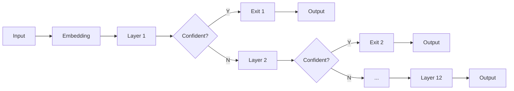

# Efficient PLMs

## from the perspective of Early Exiting

<div class="abs-br m-6 flex gap-2">
  <button @click="$slidev.nav.openInEditor()" title="Open in Editor" class="text-xl icon-btn opacity-50 !border-none !hover:text-white">
    <carbon:edit />
  </button>
  <a href="https://github.com/sbwww" target="_blank" alt="GitHub"
    class="text-xl icon-btn opacity-50 !border-none !hover:text-white">
    <carbon-logo-github />
  </a>
</div>

<style>
h2 {
  
  background-color: #fff;
}
</style>

---

## Preliminaries

<v-clicks>

<!--


-->


</v-clicks>

<style>
img {
  height: 400px;
  position: absolute;
  top: 100px;
  left: 50px;
}
</style>

<!-- https://nlp.stanford.edu/manning/talks/MILA-BERT-2019.pdf -->

---

## What & Why?

To exit after being _confident_ [^confidence] to the results during inference.

Don't need to execute **ALL** the model layers.

<br>

<v-click>

w/ EE

Layer 1 → Layer 2 → Layer 3 <span class='skip'>→ Layer 4 → ... → Layer 12</span>

&emsp; X &emsp; → &emsp; X &emsp; → &emsp; √ &emsp; → **Output**

<center>Depending on inputs</center>

</v-click>

[^confidence]: confidence $\neq$ perplexity

<style>
span.skip {
  opacity: 0.3;
}
center {
  font-size: 40px;
  padding-top: 40px;
}
</style>

---

## Illustrated Premise


- _Easy_ inputs

confident, aggressive

- _Hard_ inputs

confused, conservative

<br><br>

<v-click>

- Measuring difficulty?

open question

</v-click>

<style>
img {
  width: 60%;
  margin-right:40px;
}
</style>

---

## Illustrated Architecture

<br><br><br>



<br><br>

<v-click>

<center>Branchy</center>

</v-click>

<style>
center {
  font-size: 40px;
}
</style>

---

## Pros & Cons

- <font size=6>Pros</font>
  1. **Elastic** - single model with dynamic configs at inference time
  2. **Efficiency** - reduced inference time & energy consumption
  3. **Effectiveness** - reduced overthinking (_overfitting_ of inference) [^shallow-deep]

<v-click>

- <font size=6>Cons (Insights for new papers)</font>
  1. **Trade-off** - performance V.S. time-saving
  2. **Compatibility** - no uniformed confidence evaluation for different tasks
  3. **Implementation** - training approach influences performance

</v-click>

[^shallow-deep]: [Shallow-Deep Networks: Understanding and Mitigating Network Overthinking [ICML2019]<br>University of Maryland](https://arxiv.org/abs/1810.07052)

<style>
.footnotes p {
  font-size: 20px !important;
}
.footnotes-sep {
  @apply mt-0 opacity-10;
}
</style>

---

## How?

1. Entropy [^deebert]
2. Patience [^pabee]
3. Learning-based
4. Pre-training [^elue]

[^deebert]: [DeeBERT: Dynamic Early Exiting for Accelerating BERT Inference [ACL 2020]<br>University of Waterloo, Vector Institute of AI](https://arxiv.org/abs/2004.12993)
[^pabee]: [BERT Loses Patience: Fast and Robust Inference with Early Exit [NIPS 2020]<br>Beihang University, University of California, MSRA](https://arxiv.org/abs/2006.04152v3)
[^elue]: [Towards Efficient NLP: A Standard Evaluation and A Strong Baseline [WIP]<br>Fudan University, Huawei Poisson Lab](https://arxiv.org/abs/2110.07038v1)

<style>
.footnotes-sep {
  @apply mt-0 opacity-10;
}
</style>

---

## Method 1 --- Entropy

<br>

$$
H(x) = -\sum_{i} p(i) \ln p(i) = \ln \left(\sum_{i=1}^{n} e^{x_{i}}\right)-\frac{\sum_{i=1}^{n} x_{i} e^{x_{i}}}{\sum_{i=1}^{n} e^{x_{i}}}
$$

<br>

- $H(x)<E_T$ ? [^deebert]

  entropy lower than threshold → confident → exit

  otherwise, higher than threshold → confused → run more layers

[^deebert]: [DeeBERT: Dynamic Early Exiting for Accelerating BERT Inference [ACL 2020]<br>University of Waterloo, Vector Institute of AI](https://arxiv.org/abs/2004.12993)

---

## Illustrated Entropy --- Binary Class

$$H(x) = F(p_0) = -\big(p_0 \ln p_0 + (1-p_0) \ln (1-p_0)\big)$$

where $p_0, p_1 = \operatorname{softmax}(x)$, and $p_1 = 1-p_0$

| <center></center> | <center></center> |
| :--------------------------------------------------------------: | :-------------------------------------------------------: |

- $\argmax\limits_{p_0} F(p_0) = 0.5$, &ensp;&nbsp; $\max\limits F(p_0) = \ln 2 = 0.69$
- &emsp;&nbsp; $\lim\limits_{p_0\rightarrow 0^+} F(p_0) = 0$ &ensp; , &nbsp;&thinsp; $\lim\limits_{p_0\rightarrow 1^-} F(p_0) = 0$

<style>
img {
  width: 350px;
  transition: all 0.2s;
}
img:hover {
  background: #fff;
  transform: scale(1.5);
}
</style>

---

## Training DeeBERT

Two-stage fine-tuning

1. Ordinary fine-tuning
   - Embedding, all Transformers, and the last classifier
2. Each classifier (ex. the last) training
   - Freeze the above parameters that are already fine-tuned
   - $\mathcal{L}=\sum_{i=1}^{n-1} \mathcal{L}_{i}$

<v-click>

<br><br>

<center>Time-consuming training</center>

</v-click>

<style>
center {
  font-size: 30px;
}
</style>

---

## Implements

```py {all|2|3-6|all}
def entropy(x):
    # x: torch.Tensor, logits BEFORE softmax
    exp_x = torch.exp(x)
    A = torch.sum(exp_x, dim=1)    # sum of exp(x_i)
    B = torch.sum(x*exp_x, dim=1)  # sum of x_i * exp(x_i)
    return torch.log(A) - B/A
```

<v-click>

```py {all|1-3|4-8|all}
# GLUE BertForSequenceClassification pooled_outputs
# x.size() = (batch_size=1, num_labels=2)
[[0.0, 0.1]]
# NER  BertForTokenClassification sequence_outputs
# x.size() = (batch_size=1, seq_len=128, num_labels=9)
[[[0.0, 0.1, ..., 0.8],
  [1.0, 1.2, ..., 1.8],
             ...      ]]
```

</v-click>

---

## Fix

<br>

```py {all|3-6}
def entropy(x):
    # x: torch.Tensor, logits BEFORE softmax
    # softmax normalized prob distribution
    x = torch.softmax(x, dim=-1)
    # entropy calculation on probs: -\sum(p \ln(p))
    return -torch.sum(x*torch.log(x), dim=-1)
```

<br><br>

<v-click>

- Sometimes `dim=1`, always `dim=-1`
- `torch.softmax()` more efficient than manual calculation

</v-click>

---

## DeeBERT Results --- BERT

<br>

<table>
  <tbody>
    <tr>
      <td><span></span></td>
      <td colspan="2" style="text-align:center"><span><span>SST-2</span></span></td>
      <td colspan="2" style="text-align:center"><span><span>MRPC</span></span></td>
      <td colspan="2" style="text-align:center"><span><span>QNLI</span></span></td>
      <td colspan="2" style="text-align:center"><span><span>RTE</span></span></td>
      <td colspan="2" style="text-align:center"><span><span>QQP</span></span></td>
      <td colspan="2" style="text-align:center"><span><span>MNLI-(m/mm)</span></span></td>
    </tr>
    <tr>
      <td><span></span></td>
      <td style="text-align:center"><span><span>Acc</span></span></td>
      <td style="text-align:center"><span><span>Time</span></span></td>
      <td style="text-align:center"><span><span>F1</span></span></td>
      <td style="text-align:center"><span><span>Time</span></span></td>
      <td style="text-align:center"><span><span>Acc</span></span></td>
      <td style="text-align:center"><span><span>Time</span></span></td>
      <td style="text-align:center"><span><span>Acc</span></span></td>
      <td style="text-align:center"><span><span>Time</span></span></td>
      <td style="text-align:center"><span><span>F1</span></span></td>
      <td style="text-align:center"><span><span>Time</span></span></td>
      <td style="text-align:center"><span><span>Acc</span></span></td>
      <td style="text-align:center"><span><span>Time</span></span></td>
    </tr>
    <tr>
      <td colspan="13" style="text-align:center"><span><span><span>BERT-base</span></span></span></td>
    </tr>
    <tr>
      <td style="text-align:left"><span><span>Baseline</span></span></td>
      <td style="text-align:right"><span><span>93.6</span></span></td>
      <td style="text-align:right"><span><span>36.72s</span></span></td>
      <td style="text-align:right"><span><span>88.2</span></span></td>
      <td style="text-align:right"><span><span>34.77s</span></span></td>
      <td style="text-align:right"><span><span>91.0</span></span></td>
      <td style="text-align:right"><span><span>111.44s</span></span></td>
      <td style="text-align:right"><span><span>69.9</span></span></td>
      <td style="text-align:right"><span><span>61.26s</span></span></td>
      <td style="text-align:right"><span><span>71.4</span></span></td>
      <td style="text-align:right"><span><span>145min</span></span></td>
      <td style="text-align:right"><span><span>83.9/83.0</span></span></td>
      <td style="text-align:right"><span><span>202.84s</span></span></td>
    </tr>
    <tr>
      <td style="text-align:left"><span><span>DistilBERT</span></span></td>
      <td style="text-align:right"><span><span>-1.4</span></span></td>
      <td style="text-align:right"><span><span>-40%</span></span></td>
      <td style="text-align:right"><span><span>-1.1</span></span></td>
      <td style="text-align:right"><span><span>-40%</span></span></td>
      <td style="text-align:right"><span><span>-2.6</span></span></td>
      <td style="text-align:right"><span><span>-40%</span></span></td>
      <td style="text-align:right"><span><span>-9.4</span></span></td>
      <td style="text-align:right"><span><span>-40%</span></span></td>
      <td style="text-align:right"><span><span>-1.1</span></span></td>
      <td style="text-align:right"><span><span>-40%</span></span></td>
      <td style="text-align:right"><span><span>-4.5</span></span></td>
      <td style="text-align:right"><span><span>-40%</span></span></td>
    </tr>
    <tr>
      <td style="text-align:left"><span><span>DeeBERT</span></span></td>
      <td style="text-align:right"><span><span>-0.2</span></span></td>
      <td style="text-align:right"><span><span>-21%</span></span></td>
      <td style="text-align:right"><span><span>-0.3</span></span></td>
      <td style="text-align:right"><span><span>-14%</span></span></td>
      <td style="text-align:right"><span><span>-0.1</span></span></td>
      <td style="text-align:right"><span><span>-15%</span></span></td>
      <td style="text-align:right"><span><span>-0.4</span></span></td>
      <td style="text-align:right"><span><span>-9%</span></span></td>
      <td style="text-align:right"><span><span>-0.0</span></span></td>
      <td style="text-align:right"><span><span>-24%</span></span></td>
      <td style="text-align:right"><span><span>-0.0/-0.1</span></span></td>
      <td style="text-align:right"><span><span>-14%</span></span></td>
    </tr>
    <tr>
      <td style="text-align:left"><span><span>DeeBERT</span></span></td>
      <td style="text-align:right"><span><span>-0.6</span></span></td>
      <td style="text-align:right"><span><span>-40%</span></span></td>
      <td style="text-align:right"><span><span>-1.3</span></span></td>
      <td style="text-align:right"><span><span>-31%</span></span></td>
      <td style="text-align:right"><span><span>-0.7</span></span></td>
      <td style="text-align:right"><span><span>-29%</span></span></td>
      <td style="text-align:right"><span><span>-0.6</span></span></td>
      <td style="text-align:right"><span><span>-11%</span></span></td>
      <td style="text-align:right"><span><span>-0.1</span></span></td>
      <td style="text-align:right"><span><span>-39%</span></span></td>
      <td style="text-align:right"><span><span>-0.8/-0.7</span></span></td>
      <td style="text-align:right"><span><span>-25%</span></span></td>
    </tr>
    <tr>
      <td style="text-align:left"><span><span>DeeBERT</span></span></td>
      <td style="text-align:right"><span><span>-2.1</span></span></td>
      <td style="text-align:right"><span><span>-47%</span></span></td>
      <td style="text-align:right"><span><span>-3.0</span></span></td>
      <td style="text-align:right"><span><span>-44%</span></span></td>
      <td style="text-align:right"><span><span>-3.1</span></span></td>
      <td style="text-align:right"><span><span>-44%</span></span></td>
      <td style="text-align:right"><span><span>-3.2</span></span></td>
      <td style="text-align:right"><span><span>-33%</span></span></td>
      <td style="text-align:right"><span><span>-2.0</span></span></td>
      <td style="text-align:right"><span><span>-49%</span></span></td>
      <td style="text-align:right"><span><span>-3.9/-3.8</span></span></td>
      <td style="text-align:right"><span><span>-37%</span></span></td>
    </tr>
  </tbody>
</table>

---

## DeeBERT Results --- RoBERTa

<br>

<table style="text-align:right">
  <tbody>
    <tr>
      <td><span></span></td>
      <td colspan="2" style="text-align:center"><span><span>SST-2</span></span></td>
      <td colspan="2" style="text-align:center"><span><span>MRPC</span></span></td>
      <td colspan="2" style="text-align:center"><span><span>QNLI</span></span></td>
      <td colspan="2" style="text-align:center"><span><span>RTE</span></span></td>
      <td colspan="2" style="text-align:center"><span><span>QQP</span></span></td>
      <td colspan="2" style="text-align:center"><span><span>MNLI-(m/mm)</span></span></td>
    </tr>
    <tr>
      <td><span></span></td>
      <td style="text-align:center"><span><span>Acc</span></span></td>
      <td style="text-align:center"><span><span>Time</span></span></td>
      <td style="text-align:center"><span><span>F1</span></span></td>
      <td style="text-align:center"><span><span>Time</span></span></td>
      <td style="text-align:center"><span><span>Acc</span></span></td>
      <td style="text-align:center"><span><span>Time</span></span></td>
      <td style="text-align:center"><span><span>Acc</span></span></td>
      <td style="text-align:center"><span><span>Time</span></span></td>
      <td style="text-align:center"><span><span>F1</span></span></td>
      <td style="text-align:center"><span><span>Time</span></span></td>
      <td style="text-align:center"><span><span>Acc</span></span></td>
      <td style="text-align:center"><span><span>Time</span></span></td>
    </tr>
    <tr>
      <td colspan="13" style="text-align:center"><span><span><span>RoBERTa-base</span></span></span></td>
    </tr>
    <tr>
      <td style="text-align:left"><span><span>Baseline</span></span></td>
      <td style="text-align:right"><span><span>94.3</span></span></td>
      <td style="text-align:right"><span><span>36.73s</span></span></td>
      <td style="text-align:right"><span><span>90.4</span></span></td>
      <td style="text-align:right"><span><span>35.24s</span></span></td>
      <td style="text-align:right"><span><span>92.4</span></span></td>
      <td style="text-align:right"><span><span>112.96s</span></span></td>
      <td style="text-align:right"><span><span>67.5</span></span></td>
      <td style="text-align:right"><span><span>60.14s</span></span></td>
      <td style="text-align:right"><span><span>71.8</span></span></td>
      <td style="text-align:right"><span><span>152min</span></span></td>
      <td style="text-align:right"><span><span>87.0/86.3</span></span></td>
      <td style="text-align:right"><span><span>198.52s</span></span></td>
    </tr>
    <tr>
      <td style="text-align:left"><span><span>LayerDrop</span></span></td>
      <td style="text-align:right"><span><span>-1.8</span></span></td>
      <td style="text-align:right"><span><span>-50%</span></span></td>
      <td style="text-align:right"><span><span>-</span></span></td>
      <td style="text-align:right"><span><span>-</span></span></td>
      <td style="text-align:right"><span><span>-</span></span></td>
      <td style="text-align:right"><span><span>-</span></span></td>
      <td style="text-align:right"><span><span>-</span></span></td>
      <td style="text-align:right"><span><span>-</span></span></td>
      <td style="text-align:right"><span><span>-</span></span></td>
      <td style="text-align:right"><span><span>-</span></span></td>
      <td style="text-align:right"><span><span>-4.1</span></span></td>
      <td style="text-align:right"><span><span>-50%</span></span></td>
    </tr>
    <tr>
      <td style="text-align:left"><span><span>DeeBERT</span></span></td>
      <td style="text-align:right"><span><span><b>+0.1</b></span></span></td>
      <td style="text-align:right"><span><span><b>-26%</b></span></span></td>
      <td style="text-align:right"><span><span><b>+0.1</b></span></span></td>
      <td style="text-align:right"><span><span><b>-25%</b></span></span></td>
      <td style="text-align:right"><span><span>-0.1</span></span></td>
      <td style="text-align:right"><span><span>-25%</span></span></td>
      <td style="text-align:right"><span><span>-0.6</span></span></td>
      <td style="text-align:right"><span><span>-32%</span></span></td>
      <td style="text-align:right"><span><span><b>+0.1</b></span></span></td>
      <td style="text-align:right"><span><span><b>-32%</b></span></span></td>
      <td style="text-align:right"><span><span><b>-0.0/-0.0</b></span></span></td>
      <td style="text-align:right"><span><span><b>-19%</b></span></span></td>
    </tr>
    <tr>
      <td style="text-align:left"><span><span>DeeBERT</span></span></td>
      <td style="text-align:right"><span><span><b>-0.0</b></span></span></td>
      <td style="text-align:right"><span><span><b>-33%</b></span></span></td>
      <td style="text-align:right"><span><span><b>+0.2</b></span></span></td>
      <td style="text-align:right"><span><span><b>-28%</b></span></span></td>
      <td style="text-align:right"><span><span>-0.5</span></span></td>
      <td style="text-align:right"><span><span>-30%</span></span></td>
      <td style="text-align:right"><span><span>-0.4</span></span></td>
      <td style="text-align:right"><span><span>-33%</span></span></td>
      <td style="text-align:right"><span><span><b>-0.0</b></span></span></td>
      <td style="text-align:right"><span><span><b>-39%</b></span></span></td>
      <td style="text-align:right"><span><span>-0.1/-0.3</span></span></td>
      <td style="text-align:right"><span><span>-23%</span></span></td>
    </tr>
    <tr>
      <td style="text-align:left"><span><span>DeeBERT</span></span></td>
      <td style="text-align:right"><span><span>-1.8</span></span></td>
      <td style="text-align:right"><span><span>-44%</span></span></td>
      <td style="text-align:right"><span><span>-1.1</span></span></td>
      <td style="text-align:right"><span><span>-38%</span></span></td>
      <td style="text-align:right"><span><span>-2.5</span></span></td>
      <td style="text-align:right"><span><span>-39%</span></span></td>
      <td style="text-align:right"><span><span>-1.1</span></span></td>
      <td style="text-align:right"><span><span>-35%</span></span></td>
      <td style="text-align:right"><span><span>-0.6</span></span></td>
      <td style="text-align:right"><span><span>-44%</span></span></td>
      <td style="text-align:right"><span><span>-3.9/-4.1</span></span></td>
      <td style="text-align:right"><span><span>-29%</span></span></td>
    </tr>
  </tbody>
</table>

<v-click>

<center>Reduced Overthinking? Why RoBERTa, not BERT?</center>

</v-click>

<style>
center {
  padding-top: 20px;
  font-size: 30px;
}
</style>

---

## Illustrated Results --- Single-Sentence

|                  CoLA\*                   |                   SST-2                   |
| :---------------------------------------: | :---------------------------------------: |
|  <center></center>  |  <center></center>  |
| <center></center> | <center></center> |

<style>
img {
  width: 60%;
  transition: all 0.2s;
}
img:hover {
  background: #fff;
  transform: scale(1.75);
}
</style>

---

## Illustrated Results --- Similarity and Paraphrase

|                   MRPC                    |                  STS-B\*                  |                   QQP                   |
| :---------------------------------------: | :---------------------------------------: | :-------------------------------------: |
|  <center></center>  |  <center></center>  |  <center></center>  |
| <center></center> | <center></center> | <center></center> |

<style>
img {
  transition: all 0.2s;
}
img:hover {
  background: #fff;
  transform: scale(1.5);
}
</style>

---

## Illustrated Results --- Inference

|                   MNLI                    |                   QNLI                    |                   RTE                   |                  WNLI\*                   |
| :---------------------------------------: | :---------------------------------------: | :-------------------------------------: | :---------------------------------------: |
|  <center></center>  |  <center></center>  |  <center></center>  |  <center></center>  |
| <center></center> | <center></center> | <center></center> | <center></center> |

<style>
img {
  transition: all 0.2s;
}
img:hover {
  background: #fff;
  transform: scale(1.75);
}
</style>

---

## Extending

- NER adaption on CoNLL-2003 dataset (Token Classification, 9 labels)
  1. [CLS] token entropy → mean value of non-padding token entropies
  2. maximum threshold: $\ln 9=2.20$

|                                         |                                          |
| :-------------------------------------: | :--------------------------------------: |
| <center></center> | <center></center> |

<style>
img {
  width: 90%;
  transition: all 0.2s;
}
img:hover {
  background: #fff;
  transform: scale(1.5);
}
center {
  font-size: 24px !important;
  line-height: 1.5 !important;
}
</style>

---

## Q: What are EASY Inputs?

<v-clicks>

> The movie was awesome.

Positive

> You are good at messing up.

Negative

> I wonder whether the plot was written by a 12-year-old or by an award-winning writer.

Negative

<table>
  <thead>
    <tr>
      <th style="text-align: center;">Layer</th>
      <th style="text-align: center;">1</th>
      <th style="text-align: center;">2</th>
      <th style="text-align: center;">3</th>
      <th style="text-align: center;">4</th>
      <th style="text-align: center;">5</th>
      <th style="text-align: center;">6</th>
      <th style="text-align: center;">7</th>
      <th style="text-align: center;">8</th>
      <th style="text-align: center;">9</th>
      <th style="text-align: center;">10</th>
      <th style="text-align: center;">11</th>
      <th style="text-align: center;">12</th>
    </tr>
  </thead>
  <tbody>
    <tr>
      <td style="text-align: center;" rowspan="2">Seq 1 +</td>
      <td style="text-align: center;">√</td>
      <td style="text-align: center;">√</td>
      <td style="text-align: center;">√</td>
      <td style="text-align: center;">√</td>
      <td style="text-align: center;">√</td>
      <td style="text-align: center;">√</td>
      <td style="text-align: center;">√</td>
      <td style="text-align: center;">√</td>
      <td style="text-align: center;">√</td>
      <td style="text-align: center;">√</td>
      <td style="text-align: center;">√</td>
      <td style="text-align: center;">√</td>
    </tr>
    <tr>
      <td style="text-align: center;">0.6252</td>
      <td style="text-align: center;">0.6200</td>
      <td style="text-align: center;">0.6339</td>
      <td style="text-align: center;">0.4669</td>
      <td style="text-align: center;">0.4287</td>
      <td style="text-align: center;">0.1127</td>
      <td style="text-align: center;">0.0373</td>
      <td style="text-align: center;">0.0043</td>
      <td style="text-align: center;">0.0004</td>
      <td style="text-align: center;">0.0011</td>
      <td style="text-align: center;">0.0020</td>
      <td style="text-align: center;">0.0023</td>
    </tr>
    <tr>
      <td style="text-align: center;" rowspan="2">Seq 2 -</td>
      <td style="text-align: center;">√</td>
      <td style="text-align: center;">√</td>
      <td style="text-align: center;">√</td>
      <td style="text-align: center;">×</td>
      <td style="text-align: center;">×</td>
      <td style="text-align: center;">×</td>
      <td style="text-align: center;">×</td>
      <td style="text-align: center;">×</td>
      <td style="text-align: center;">×</td>
      <td style="text-align: center;">×</td>
      <td style="text-align: center;">×</td>
      <td style="text-align: center;">×</td>
    </tr>
    <tr>
      <td style="text-align: center;">0.6930</td>
      <td style="text-align: center;">0.6813</td>
      <td style="text-align: center;">0.6720</td>
      <td style="text-align: center;">0.6517</td>
      <td style="text-align: center;">0.6806</td>
      <td style="text-align: center;">0.2823</td>
      <td style="text-align: center;">0.0712</td>
      <td style="text-align: center;">0.0721</td>
      <td style="text-align: center;">0.0082</td>
      <td style="text-align: center;">0.0113</td>
      <td style="text-align: center;">0.0076</td>
      <td style="text-align: center;">0.0032</td>
    </tr>
    <tr>
      <td style="text-align: center;" rowspan="2">Seq 3 -</td>
      <td style="text-align: center;">×</td>
      <td style="text-align: center;">√</td>
      <td style="text-align: center;">×</td>
      <td style="text-align: center;">√</td>
      <td style="text-align: center;">√</td>
      <td style="text-align: center;">√</td>
      <td style="text-align: center;">√</td>
      <td style="text-align: center;">√</td>
      <td style="text-align: center;">√</td>
      <td style="text-align: center;">√</td>
      <td style="text-align: center;">√</td>
      <td style="text-align: center;">√</td>
    </tr>
    <tr>
      <td style="text-align: center;">0.6876</td>
      <td style="text-align: center;">0.6885</td>
      <td style="text-align: center;">0.6905</td>
      <td style="text-align: center;">0.6722</td>
      <td style="text-align: center;">0.6250</td>
      <td style="text-align: center;">0.4451</td>
      <td style="text-align: center;">0.1349</td>
      <td style="text-align: center;">0.1357</td>
      <td style="text-align: center;">0.0786</td>
      <td style="text-align: center;">0.0318</td>
      <td style="text-align: center;">0.0412</td>
      <td style="text-align: center;">0.0363</td>
    </tr>
  </tbody>
</table>

</v-clicks>

<style>
p {
  font-size: 20px;
  margin: 5px 0px 5px 0px !important;
}
td {
  padding: 5px 0px 5px 0px !important;
}
</style>

---

## Illustrated Inputs


<style>
img {
  position: absolute;
  top: 80px;
  left: 0px;
}
</style>

---

## Inputs Difficulty

[Spearman’s correlation](https://en.wikipedia.org/wiki/Spearman%27s_rank_correlation_coefficient) $\rho$ between _confidence_ and input features [^right-tool]

```py
confidences, predictions = torch.max(softmaxes, dim=1)
```

<table>
  <tr>
  <td class="inner">
  <table>
    <thead>
      <tr>
        <th style="text-align: left">Dataset</th>
        <th style="text-align: right">Length</th>
        <th style="text-align: right">Consistency</th>
      </tr>
    </thead>
    <tbody>
      <tr>
        <td style="text-align: left">AG</td>
        <td style="text-align: right">0.13</td>
        <td style="text-align: right">0.37</td>
      </tr>
      <tr>
        <td style="text-align: left">IMDB</td>
        <td style="text-align: right">–0.17</td>
        <td style="text-align: right">0.47</td>
      </tr>
      <tr>
        <td style="text-align: left">SST</td>
        <td style="text-align: right">–0.19</td>
        <td style="text-align: right">0.36</td>
      </tr>
      <tr>
        <td style="text-align: left">SNLI</td>
        <td style="text-align: right">–0.08</td>
        <td style="text-align: right">0.44</td>
      </tr>
      <tr>
        <td style="text-align: left">MNLI</td>
        <td style="text-align: right">–0.13</td>
        <td style="text-align: right">0.39</td>
      </tr>
    </tbody>
  </table>
  </td>
  <td>
    <ol>
      <li>
        <p>Length - confidence of 1st classifier</p>
        <p>Loose, negative (exc. AG, news topic detect)</p>
      </li>
      <li>
        <p>Consistency - confidence of 1st classifier</p>  
        <p>Medium, positive</p>
      </li>
    </ol>
  </td>
  </tr>
</table>

[^right-tool]: [The Right Tool for the Job: Matching Model and Instance Complexities [ACL 2020]<br>Allen AI, University of Washington](https://arxiv.org/abs/2004.07453)

<style>
td {
  padding: 8px 10px 8px 5px !important;
}
.inner {
  width: 50%;
}
li, li p {
  font-size: 20px !important;
}
.footnotes-sep {
  @apply mt-0 opacity-10;
}
</style>

<!-- Consistency
whether all classifiers in our model agree on the prediction of a given instance, regardless of whether it is correct or not -->

---

## Method 2 --- Patience


PABEE [^pabee]

[^pabee]: [BERT Loses Patience: Fast and Robust Inference with Early Exit [NIPS 2020]<br>Beihang University, University of California, MSRA](https://arxiv.org/abs/2006.04152v3)

<style>
p {
  text-align: center;
}
img {
  width: 75%;
  margin-left: auto;
  margin-right: auto;
  left: 0;
  right: 0;
  text-align: center;
}
.footnotes-sep {
  @apply mt-5 opacity-10;
}
.footnotes p {
  text-align: left;
}
</style>

---

## Illustrated Patience


<style>
img {
  width: 80%;
  margin-left: auto;
  margin-right: auto;
  left: 0;
  right: 0;
  text-align: center;
}
</style>

---

## Training PABEE

One-stage fine-tuning

- Weighted average loss following [^shallow-deep] $\mathcal{L}=\frac{\sum_{j=1}^{n} j \cdot \mathcal{L}_{j}}{\sum_{j=1}^{n} j}$

what about descending [^desc] $\mathcal{L}_{desc}=\frac{\sum_{j=1}^{n} (n+1-j) \cdot \mathcal{L}_{j}}{\sum_{j=1}^{n} j}$

[^shallow-deep]: [Shallow-Deep Networks: Understanding and Mitigating Network Overthinking [ICML 2019]<br>University of Maryland](https://arxiv.org/abs/1810.07052)
[^desc]: [模型早退技术(二): 中间分类层训练方法 [知乎]](https://zhuanlan.zhihu.com/p/440798536)

<style>
.footnotes p {
  font-size: 20px !important;
}
.footnotes-sep {
  @apply mt-15 opacity-10;
}
.katex {
  font-size: 1.5em !important;
}
</style>

---

## PABEE Results --- BERT


<style>
img {
  width: 70%;
  margin-left: auto;
  margin-right: auto;
  left: 0;
  right: 0;
  text-align: center;
}
</style>

---

## PABEE Results --- ALBERT


<style>
img {
  width: 90%;
  margin-left: auto;
  margin-right: auto;
  left: 0;
  right: 0;
  text-align: center;
}
</style>

<!-- why not BERT -->

---

## PABEE Results --- Overthinking


<style>
img {
  width: 90%;
  margin-left: auto;
  margin-right: auto;
  left: 0;
  right: 0;
  text-align: center;
}
</style>

<!--
one-stage training, final classifier not good
why speedup and patience same coordinates?
-->

---

## Theorem

- PABEE **improves** the accuracy $\quad s.t. \quad n-t<\left(\frac{1}{2 q}\right)^{t}\left(\frac{p}{q}\right)-p \quad$ where
  - $t$ - patience
  - $n$ - _internal_ classifiers (IC) ($n=12$) ???
  - $q$ - error rate of internal classifiers (ex. the final)
  - $p$ - error rate of the final classifier and the original classifier (w/o ICs) ???

1. main text &emsp;&emsp;&emsp; $n-t<\left(\frac{1}{2 q}\right)^{t}\left(\frac{p}{q}\right)-p$
2. appendix recap &ensp; $n-t<\left(\frac{1}{2 q}\right)^{t+1}p-q$
3. appendix proof &ensp; $n-t<\frac{\left(\frac{1}{2 q}\right)^{t}\left(\frac{p}{q}\right)-q}{1-q}<\left(\frac{1}{2 q}\right)^{t}\left(\frac{p}{q}\right)-q$ ???

<style>
ol li {
  padding: 8px 0px 8px 0px;
}
</style>

---

## Method 3 --- Pre-training

ElasticBERT [^elue] --- Pre-trained multi-exit Transformer

[^elue]: [Towards Efficient NLP: A Standard Evaluation and A Strong Baseline [WIP]<br>Fudan University, Huawei Poisson Lab](https://arxiv.org/abs/2110.07038v1)

<v-click>

> Q: Why don't fine-tune BERT, but pre-train a new one?

</v-click>

<br>

<v-click>

> A: Gap between pre-training and fine-tuning hurt the performance!

</v-click>


<style>
img {
  width: 8%;
  margin-left: auto;
  margin-right: auto;
  left: 0;
  right: 0;
  text-align: center;
}
.footnotes-sep {
  @apply mt-10 opacity-10;
}
</style>

<!-- The two losses are applied to each layer of the model -->

---

## Training ElasticBERT --- Objectives

Pre-training objectives

- masked language mode (MLM)
- sentence order prediction (SOP)

$$
\mathcal{L}=\sum_{l=1}^{L}\left(\mathcal{L}_{l}^{\mathrm{MLM}}+\mathcal{L}_{l}^{\mathrm{SOP}}\right)
$$

<br>

$\because$ The two losses are applied to each layer of the model

$\therefore$ Number of layers can be flexibly scaled

---

## Training ElasticBERT --- Gradient Equilibrium

Re-scaling (re-normalizing) gradient [^gradient-equilibrium]

Summed loss → overlap of subnetworks → gradient imbalance

Averaged loss → small gradients → hinders convergence

$$
\begin{aligned}
\nabla_{w_{i}}^{(\mathrm{GE})} \mathcal{L}_{j} &=\prod_{i \leq h<j} \frac{k-h}{k-h+1} \times \frac{1}{k-j+1} \times \nabla_{w_{i}} \mathcal{L}_{j} \\
&=\frac{1}{k-i+1} \nabla_{w_{i}} \mathcal{L}_{j}
\end{aligned}
$$

[^gradient-equilibrium]: [Improved Techniques for Training Adaptive Deep Networks [ICCV 2019]<br>THU, Baidu, University of Oxford](https://arxiv.org/abs/1908.06294)

---

## Training ElasticBERT --- Grouped Training

Summing losses at all layers → slow pre-training + increased memory

1. Divide $L$ exits into $G$ groups
2. Optimize losses of exit classifiers within each group
3. Round Robin between different batches

$$
\mathcal{L}=\sum_{l \in \mathcal{G}_{i}}\left(\mathcal{L}_{l}^{\mathrm{MLM}}+\mathcal{L}_{l}^{\mathrm{SOP}}\right)
$$

E.g., for 12 Layers, $\mathcal{G}_{1}=\{1,3,5,7,9,11,12\}$, $\mathcal{G}_{2}=\{2,4,6,8,10,12\}$

---

## ElasticBERT Results --- Static Base

<table>
  <thead>
    <tr>
      <th style="text-align:center">Models</th>
      <th style="text-align:center">#Params</th>
      <th style="text-align:center">CoLA</th>
      <th style="text-align:center">MNLI-(m/mm)</th>
      <th style="text-align:center">MRPC</th>
      <th style="text-align:center">QNLI</th>
      <th style="text-align:center">QQP</th>
      <th style="text-align:center">RTE</th>
      <th style="text-align:center">SST-2</th>
      <th style="text-align:center">STS-B</th>
      <th style="text-align:center">Average</th>
    </tr>
  </thead>
  <tbody>
    <tr>
      <td style="text-align:left">BERT<sub>BASE</sub></td>
      <td style="text-align:right">109M</td>
      <td style="text-align:right">56.5</td>
      <td style="text-align:right">84.6/84.9</td>
      <td style="text-align:right">87.6</td>
      <td style="text-align:right">91.2</td>
      <td style="text-align:right">89.6</td>
      <td style="text-align:right">69.0</td>
      <td style="text-align:right">92.9</td>
      <td style="text-align:right">89.4</td>
      <td style="text-align:right">82.9</td>
    </tr>
    <tr>
      <td style="text-align:left">ALBERT<sub>BASE</sub></td>
      <td style="text-align:right">12M</td>
      <td style="text-align:right">56.8</td>
      <td style="text-align:right">84.9/85.6</td>
      <td style="text-align:right">90.5</td>
      <td style="text-align:right">91.4</td>
      <td style="text-align:right">89.2</td>
      <td style="text-align:right">78.3</td>
      <td style="text-align:right">92.8</td>
      <td style="text-align:right">90.7</td>
      <td style="text-align:right">84.5</td>
    </tr>
    <tr>
      <td style="text-align:left">RoBERTa<sub>BASE</sub></td>
      <td style="text-align:right">125M</td>
      <td style="text-align:right">63.6</td>
      <td style="text-align:right">87.5/87.2</td>
      <td style="text-align:right">90.8</td>
      <td style="text-align:right">92.7</td>
      <td style="text-align:right">90.3</td>
      <td style="text-align:right">77.5</td>
      <td style="text-align:right">94.8</td>
      <td style="text-align:right">90.9</td>
      <td style="text-align:right">86.1</td>
    </tr>
    <tr>
      <td style="text-align:left">ElasticBERT<sub>BASE</sub></td>
      <td style="text-align:right">109M</td>
      <td style="text-align:right">64.3</td>
      <td style="text-align:right">85.3/85.9</td>
      <td style="text-align:right">91.0</td>
      <td style="text-align:right">92.0</td>
      <td style="text-align:right">90.2</td>
      <td style="text-align:right">76.5</td>
      <td style="text-align:right">94.3</td>
      <td style="text-align:right">90.7</td>
      <td style="text-align:right">85.6</td>
    </tr>
    <tr>
      <td style="text-align:left">BERT<sub>BASE</sub>-6L</td>
      <td style="text-align:right">67M</td>
      <td style="text-align:right">44.6</td>
      <td style="text-align:right">81.4/81.4</td>
      <td style="text-align:right">84.9</td>
      <td style="text-align:right">87.4</td>
      <td style="text-align:right">88.7</td>
      <td style="text-align:right">65.7</td>
      <td style="text-align:right">90.9</td>
      <td style="text-align:right">88.1</td>
      <td style="text-align:right">79.2</td>
    </tr>
    <tr>
      <td style="text-align:left">ALBERT<sub>BASE</sub>-6L</td>
      <td style="text-align:right">12M</td>
      <td style="text-align:right">52.4</td>
      <td style="text-align:right">82.6/82.2</td>
      <td style="text-align:right">89.0</td>
      <td style="text-align:right">89.8</td>
      <td style="text-align:right">88.7</td>
      <td style="text-align:right">70.4</td>
      <td style="text-align:right">90.8</td>
      <td style="text-align:right">89.6</td>
      <td style="text-align:right">81.7</td>
    </tr>
    <tr>
      <td style="text-align:left">RoBERTa<sub>BASE</sub>-6L</td>
      <td style="text-align:right">82M</td>
      <td style="text-align:right">44.4</td>
      <td style="text-align:right">84.2/84.6</td>
      <td style="text-align:right">87.9</td>
      <td style="text-align:right">90.5</td>
      <td style="text-align:right">89.8</td>
      <td style="text-align:right">60.6</td>
      <td style="text-align:right">92.1</td>
      <td style="text-align:right">89.0</td>
      <td style="text-align:right">80.3</td>
    </tr>
    <tr>
      <td style="text-align:left">MobileBERT</td>
      <td style="text-align:right">25M</td>
      <td style="text-align:right">52.1</td>
      <td style="text-align:right">83.9/83.5</td>
      <td style="text-align:right">89.3</td>
      <td style="text-align:right">91.3</td>
      <td style="text-align:right">88.9</td>
      <td style="text-align:right">63.5</td>
      <td style="text-align:right">91.3</td>
      <td style="text-align:right">87.2</td>
      <td style="text-align:right">81.2</td>
    </tr>
    <tr>
      <td style="text-align:left">TinyBERT-6L</td>
      <td style="text-align:right">67M</td>
      <td style="text-align:right">46.3</td>
      <td style="text-align:right">83.6/83.8</td>
      <td style="text-align:right">88.7</td>
      <td style="text-align:right">90.6</td>
      <td style="text-align:right">89.1</td>
      <td style="text-align:right">73.6</td>
      <td style="text-align:right">92.0</td>
      <td style="text-align:right">89.4</td>
      <td style="text-align:right">81.9</td>
    </tr>
    <tr>
      <td style="text-align:left">ElasticBERT<sub>BASE</sub>-6L</td>
      <td style="text-align:right">67M</td>
      <td style="text-align:right"><b>53.7</b></td>
      <td style="text-align:right"><b>84.3</b>/84.2</td>
      <td style="text-align:right"><b>89.7</b></td>
      <td style="text-align:right">90.8</td>
      <td style="text-align:right">89.7</td>
      <td style="text-align:right"><b>74.0</b></td>
      <td style="text-align:right"><b>92.7</b></td>
      <td style="text-align:right"><b>90.2</b></td>
      <td style="text-align:right"><b>83.3</b></td>
    </tr>
    <tr>
      <td style="text-align:center" colspan=11>Test Set Results</td>
    </tr>
    <tr>
      <td style="text-align:left">TinyBERT-6L</td>
      <td style="text-align:right">67M</td>
      <td style="text-align:right">42.5</td>
      <td style="text-align:right">83.2/82.4</td>
      <td style="text-align:right">86.2</td>
      <td style="text-align:right">89.6</td>
      <td style="text-align:right">79.6</td>
      <td style="text-align:right">73.0</td>
      <td style="text-align:right">91.8</td>
      <td style="text-align:right">85.7</td>
      <td style="text-align:right">79.3</td>
    </tr>
    <tr>
      <td style="text-align:left">ElasticBERT<sub>BASE</sub>-6L</td>
      <td style="text-align:right">67M</td>
      <td style="text-align:right"><b>49.1</b></td>
      <td style="text-align:right"><b>83.7/83.4</b></td>
      <td style="text-align:right"><b>87.3</b></td>
      <td style="text-align:right"><b>90.4</b></td>
      <td style="text-align:right"><b>79.7</b></td>
      <td style="text-align:right">68.7</td>
      <td style="text-align:right"><b>92.9</b></td>
      <td style="text-align:right"><b>86.9</b></td>
      <td style="text-align:right"><b>80.3</b></td>
    </tr>
  </tbody>
</table>

<style>
p {
  font-size: 20px;
  margin: 5px 0px 5px 0px !important;
}
td {
  padding: 5px 0px 5px 0px !important;
}
</style>

---

## ElasticBERT Results --- Static Large

<table>
  <thead>
    <tr>
      <th style="text-align:center">Models</th>
      <th style="text-align:center">#Params</th>
      <th style="text-align:center">CoLA</th>
      <th style="text-align:center">MNLI-(m/mm)</th>
      <th style="text-align:center">MRPC</th>
      <th style="text-align:center">QNLI</th>
      <th style="text-align:center">QQP</th>
      <th style="text-align:center">RTE</th>
      <th style="text-align:center">SST-2</th>
      <th style="text-align:center">STS-B</th>
      <th style="text-align:center">Average</th>
    </tr>
  </thead>
  <tbody>
    <tr>
      <td style="text-align:left">BERT<sub>LARGE</sub></td>
      <td style="text-align:right">335M</td>
      <td style="text-align:right">61.6</td>
      <td style="text-align:right">86.2/86</td>
      <td style="text-align:right">90.1</td>
      <td style="text-align:right">92.2</td>
      <td style="text-align:right">90.1</td>
      <td style="text-align:right">72.9</td>
      <td style="text-align:right">93.5</td>
      <td style="text-align:right">90.4</td>
      <td style="text-align:right">84.8</td>
    </tr>
    <tr>
      <td style="text-align:left">ALBERT<sub>LARGE</sub></td>
      <td style="text-align:right">18M</td>
      <td style="text-align:right">60.1</td>
      <td style="text-align:right">86/86.1</td>
      <td style="text-align:right">90.4</td>
      <td style="text-align:right">91.6</td>
      <td style="text-align:right">89.6</td>
      <td style="text-align:right">83.0</td>
      <td style="text-align:right">95.2</td>
      <td style="text-align:right">91.4</td>
      <td style="text-align:right">85.9</td>
    </tr>
    <tr>
      <td style="text-align:left">RoBERTa<sub>LARGE</sub></td>
      <td style="text-align:right">355M</td>
      <td style="text-align:right">66.4</td>
      <td style="text-align:right">89/89.6</td>
      <td style="text-align:right">91.6</td>
      <td style="text-align:right">94.2</td>
      <td style="text-align:right">90.7</td>
      <td style="text-align:right">86.6</td>
      <td style="text-align:right">95.4</td>
      <td style="text-align:right">92.3</td>
      <td style="text-align:right">88.4</td>
    </tr>
    <tr>
      <td style="text-align:left">ElasticBERT<sub>LARGE</sub></td>
      <td style="text-align:right">335M</td>
      <td style="text-align:right">66.3</td>
      <td style="text-align:right">88/88.5</td>
      <td style="text-align:right">92.0</td>
      <td style="text-align:right">93.6</td>
      <td style="text-align:right">90.9</td>
      <td style="text-align:right">83.1</td>
      <td style="text-align:right">95.3</td>
      <td style="text-align:right">91.7</td>
      <td style="text-align:right">87.7</td>
    </tr>
    <tr>
      <td style="text-align:left">BERT<sub>LARGE</sub>-12L</td>
      <td style="text-align:right">184M</td>
      <td style="text-align:right">42.6</td>
      <td style="text-align:right">81/81.1</td>
      <td style="text-align:right">81.6</td>
      <td style="text-align:right">87.2</td>
      <td style="text-align:right">89.3</td>
      <td style="text-align:right">65.7</td>
      <td style="text-align:right">89.3</td>
      <td style="text-align:right">88.7</td>
      <td style="text-align:right">78.5</td>
    </tr>
    <tr>
      <td style="text-align:left">ALBERT<sub>LARGE</sub>-12L</td>
      <td style="text-align:right">18M</td>
      <td style="text-align:right">59.0</td>
      <td style="text-align:right">85.3/85.8</td>
      <td style="text-align:right">90.1</td>
      <td style="text-align:right">91.4</td>
      <td style="text-align:right">89.6</td>
      <td style="text-align:right">76.7</td>
      <td style="text-align:right">93.3</td>
      <td style="text-align:right">91.3</td>
      <td style="text-align:right">84.7</td>
    </tr>
    <tr>
      <td style="text-align:left">RoBERTa<sub>LARGE</sub>-12L</td>
      <td style="text-align:right">204M</td>
      <td style="text-align:right">62.3</td>
      <td style="text-align:right">86.3/86.2</td>
      <td style="text-align:right">89.4</td>
      <td style="text-align:right">92.3</td>
      <td style="text-align:right">90.4</td>
      <td style="text-align:right">71.8</td>
      <td style="text-align:right">93.5</td>
      <td style="text-align:right">91.1</td>
      <td style="text-align:right">84.8</td>
    </tr>
    <tr>
      <td style="text-align:left">ElasticBERT<sub>LARGE</sub>-12L</td>
      <td style="text-align:right">184M</td>
      <td style="text-align:right">62.1</td>
      <td style="text-align:right">86.2/<b>86.4</b></td>
      <td style="text-align:right">89.5</td>
      <td style="text-align:right"><b>92.5</b></td>
      <td style="text-align:right"><b>90.6</b></td>
      <td style="text-align:right"><b>79.1</b></td>
      <td style="text-align:right">93.0</td>
      <td style="text-align:right"><b>91.6</b></td>
      <td style="text-align:right"><b>85.7</b></td>
    </tr>
    <tr>
      <td style="text-align:center" colspan=11>Test Set Results</td>
    </tr>
    <tr>
      <td style="text-align:left">RoBERTa<sub>LARGE</sub>-12L</td>
      <td style="text-align:right">204M</td>
      <td style="text-align:right">59.4</td>
      <td style="text-align:right">86.4/85.2</td>
      <td style="text-align:right">87.6</td>
      <td style="text-align:right">91.6</td>
      <td style="text-align:right">80.4</td>
      <td style="text-align:right">67.3</td>
      <td style="text-align:right">94.6</td>
      <td style="text-align:right">89.5</td>
      <td style="text-align:right">82.4</td>
    </tr>
    <tr>
      <td style="text-align:left">ElasticBERT<sub>LARGE</sub>-12L</td>
      <td style="text-align:right">184M</td>
      <td style="text-align:right">57.0</td>
      <td style="text-align:right">85.4/84.9</td>
      <td style="text-align:right"><b>87.7</b></td>
      <td style="text-align:right"><b>92.3</b></td>
      <td style="text-align:right"><b>81.2</b></td>
      <td style="text-align:right"><b>71.8</b></td>
      <td style="text-align:right">92.9</td>
      <td style="text-align:right"><b>89.7</b></td>
      <td style="text-align:right"><b>82.6</b></td>
    </tr>
  </tbody>
</table>

<style>
p {
  font-size: 20px;
  margin: 5px 0px 5px 0px !important;
}
td {
  padding: 5px 0px 5px 0px !important;
}
</style>

---

## ElasticBERT Results --- Dynamic

| <center> SST-2</center>         | <center> IMDb</center> | <center> SNLI</center>  |
| --------------------------------------------------------------- | ------------------------------------------------------ | ------------------------------------------------------- |
| <center> SciTail</center> | <center> MRPC</center> | <center> STS-B</center> |

<style>
img {
  width: 300px;
  transition: all 0.2s;
}
img:hover {
  background: #fff;
  transform: scale(1.5);
}
</style>

---

## Benchmarking

|                  SOTA                   |             Pareto SOTA [^elue]             |
| :-------------------------------------: | :-----------------------------------------: |
| <center></center> | <center></center> |

[^elue]: [Towards Efficient NLP: A Standard Evaluation and A Strong Baseline [WIP]<br>Fudan University, Huawei Poisson Lab](https://arxiv.org/abs/2110.07038v1)

<style>
.footnotes-sep {
  @apply mt-0 opacity-10;
}
img {
  height: 250px;
  transition: all 0.2s;
}
img:hover {
  background: #fff;
  transform: scale(1.5);
}
</style>

<!--
Xuanjing Huang, Xipeng Qiu
Tianxiang Sun
-->

---

## Pareto

<Youtube id="9sXEBzI1R5Q" width="600" height="430" />

<style>
iframe {
  margin-left: auto;
  margin-right: auto;
  left: 0;
  right: 0;
  text-align: center;
}
</style>

---

## ELUE

**E**fficient **L**anguage **U**nderstanding **E**valuation

on SST-2, IMDb, MRPC, STS-B, SNLI and SciTail

w.r.t.

1. performance &emsp;&emsp;&emsp;&emsp;&ensp; (static & dynamic)
2. FLOPs [^flops] &emsp;&emsp;&emsp;&emsp;&emsp;&emsp;&thinsp; (static & dynamic)
3. number of parameters &nbsp; (static)

[^flops]:
    FLOP<u>s</u> and FLOP<u>S</u> are different!<br>
    FLOPs: floating point operation**s**<br>
    FLOPS: floating point operations **per second**

---

## ELUE Score

12 layers of ElasticBERT → 12 discrete coordinates → continuous curve


$$\text {score}=\frac{1}{n} \sum_{i=1}^{n}\left[p_{i}-p^{E B}\left(f_{i}\right)\right]$$

<style>
img {
  width: 65%;
  margin-left: auto;
  margin-right: auto;
  left: 0;
  right: 0;
  text-align: center;
}
</style>

---

## ELUE Leaderboard


---

## Recap & Insights

1. Complexity and confidence
   1. From single / multiple layers' logits
   2. From input features
   3. Learning-based
2. Training
   1. One-stage (joint) / two-stage (separate) fine-tuning
   2. Summed / averaged / weighted / re-scaled loss
   3. ~~Pre-training (ElasticBERT pre-trained on 64 V100)~~
3. Select backbone, evaluate with ELUE
4. Can EE really **dominate** their backbone? Why & how? (question from PABEE)
5. Combining compression a good idea?

<style>
li {
  padding: 1px 0px 1px 0px !important;
  line-height: 1.5 !important;
}
</style>

---

## Further --- Split Computing


<style>
img {
  width: 75%;
  margin-left: auto;
  margin-right: auto;
  left: 0;
  right: 0;
  text-align: center;
  transition: all 0.2s;
}
img:hover {
  background: #fff;
  transform: scale(1.5);
}
</style>

---

## Further --- Bottleneck Injection [^split]


[^split]: [Split Computing and Early Exiting for Deep Learning Applications: Survey and Research Challenges [WIP]<br>University of California, Northeastern University](https://arxiv.org/abs/2103.04505v3)

<style>
img {
  width: 75%;
  margin-left: auto;
  margin-right: auto;
  left: 0;
  right: 0;
  text-align: center;
}
.footnotes-sep {
  @apply opacity-10;
  margin-top: -30px;
}
.footnotes p {
  font-size: 20px !important;
  line-height: 1.75rem !important;
}
</style>
