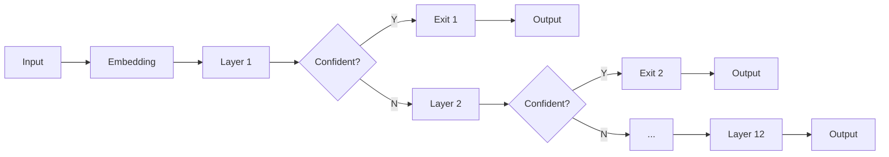

# Efficient PLMs

## from the perspective of Early Exiting

  <button @click="$slidev.nav.openInEditor()" title="Open in Editor" class="text-xl icon-btn opacity-50 !border-none !hover:text-white">
    <carbon:edit />
  </button>
  <a href="https://github.com/sbwww" target="_blank" alt="GitHub"
    class="text-xl icon-btn opacity-50 !border-none !hover:text-white">
    <carbon-logo-github />
  </a>

---

## What & Why?

To exit after being _confident_ to the results during inference.

Don't need to execute **ALL** the model layers.

  

---

## How?

1. Entropy [^deebert]
2. Patience [^pabee]
3. Learning-based
4. Pretraining [^elue]

[^deebert]: [DeeBERT: Dynamic Early Exiting for Accelerating BERT Inference [ACL 2020] University of Waterloo, Vector Institute of AI](https://arxiv.org/abs/2004.12993)
[^pabee]: [BERT Loses Patience: Fast and Robust Inference with Early Exit [NIPS 2020] Beihang University, University of California, MSRA](https://arxiv.org/abs/2006.04152v3)
[^elue]: [Towards Efficient NLP: A Standard Evaluation and A Strong Baseline [WIP] Fudan University, Huawei Poisson Lab](https://arxiv.org/abs/2110.07038v1)

---

## Method 1 --- Entropy

DeeBERT [^deebert]

1. Entropy as confidence
2. No further pretraining
3. Single model with multiple inference configs

[^deebert]: [DeeBERT: Dynamic Early Exiting for Accelerating BERT Inference [ACL 2020] University of Waterloo, Vector Institute of AI](https://arxiv.org/abs/2004.12993)

---

## Method 2 --- Patience

PABEE [^pabee]

1. Patience as confidence
2. One-stage fine-tuning
3. Even better performance with shorter inference time!?

[^pabee]: [BERT Loses Patience: Fast and Robust Inference with Early Exit [NIPS 2020] Beihang University, University of California, MSRA](https://arxiv.org/abs/2006.04152v3)

---

## Method 3 --- Pretraining

ElasticBERT [^elue]

1. Pretrained multi-exit Transformer
2. Static (base 6-layer) **beats** BERT, RoBERTa, ALBERT, MobileBERT, TinyBERT
3. Dynamic (earlt exit backbone) **beats** DeeBERT, PABEE

[^elue]: [Towards Efficient NLP: A Standard Evaluation and A Strong Baseline [WIP] Fudan University, Huawei Poisson Lab](https://arxiv.org/abs/2110.07038v1)

---

## Benchmarking

|                  SOTA                   |             Pareto SOTA [^elue]             |
| :-------------------------------------: | :-----------------------------------------: |
| 

 | 

 |

[^elue]: [Towards Efficient NLP: A Standard Evaluation and A Strong Baseline [WIP] Fudan University, Huawei Poisson Lab](https://arxiv.org/abs/2110.07038v1)

